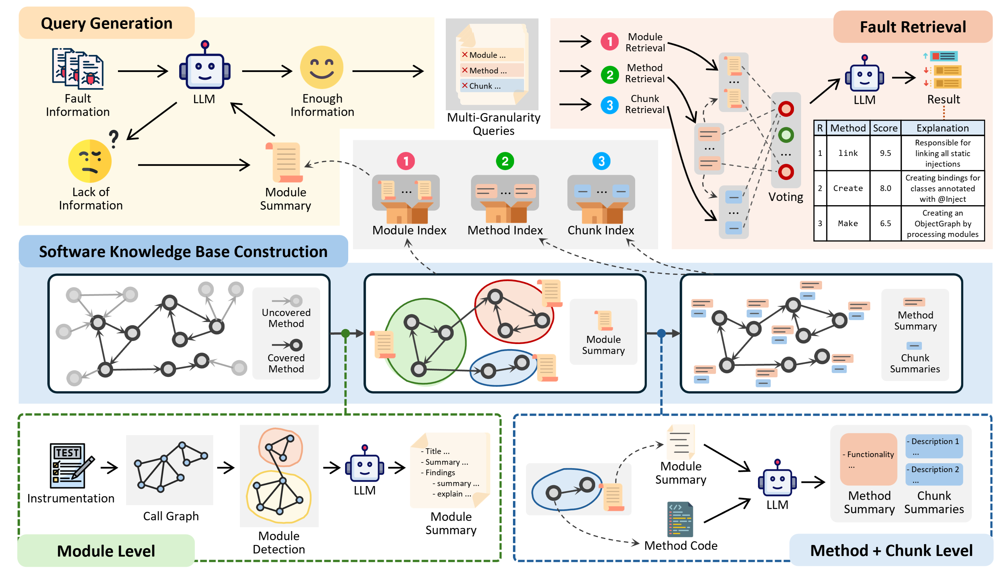

# CosFL

This is the official repository of paper **"Fault Localization from the Semantic Code Search Perspective"**.

In this work, we present CosFL, a novel Fault Localization (FL) approach inspired by semantic Code Search (CS).
CosFL proposes to regard FL tasks as a two-step process: the **query generation** for generating a natural language query to describe the problematic software functionalities, and the **suspicious code search** which employs CS to directly match buggy program elements from the entire code repository.
Evaluation results on 835 real bugs show that CosFL significantly outperforms other state-of-the-art approaches, potentially paving new pathways for the advancement of FL techniques.

## Run CosFL from Scratch

### Step 1: Install the Benchmarks

We evaluate CosFL on two Java benchmarks, they can be installed at:

Defects4J: [https://github.com/rjust/defects4j](https://github.com/rjust/defects4j)

GrowingBugs: [https://github.com/liuhuigmail/GrowingBugRepository](https://github.com/liuhuigmail/GrowingBugRepository)

### Step 2: Prepare Environment

You can easily install the required Python environment through the commands:

```shell
conda create -n CosFL python=3.9
conda activate CosFL
pip install -r requirements.txt
```

Don't forget to install Java 1.8:

```shell
sudo apt-get install openjdk-8-jdk -y
```

Then, adopt the files under `BenchmarkMode` directory to support program instrumentation for the benchmark commands.

Finally, modify the config files in `Config` directory. You should focus on these properties:

- `agent_lib`: set as the path of the Java agent `lib/classtracer-1.0.jar`
- `D4J_exec`: set to your own Defects4J execution file path
- `GB_exec`: set to your own GrowingBugs execution file path
- `api_key`: set to your own api key for corresponding model

### Step 3: Run CosFL

You can now directly run CosFL to localize all bugs with:
```shell
python run_all.py
```

For localizing a single bug, an example command is:
```shell
python run.py --config default.yaml --version d4j1.4.0 --project Chart --bugID 1 --subproj 
```

You can see the list of all bugs in `projects.py`.

## Evaluate CosFL

After running CosFL, the debugging results will be put under `DebugResult` directory.

To evaluate the performance of CosFL, simply run:
```shell
python Evaluation/evaluate.py
```